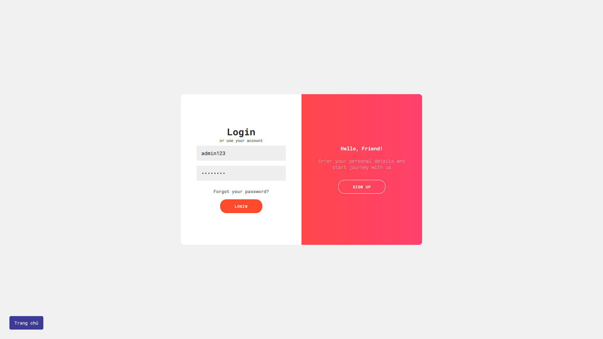

# Giới thiệu/Quy mô:

- Website mạng xã hội và thương mại điện tử.
  Cung cấp môi trường mạng xã hội giúp mọi người đăng tải và tìm kiếm thông tin bài viết.
  Người dùng còn có thể đăng bán và mua các sản phẩm như 1 sàn thương mại điện tử.

- Tính năng bản đồ du lịch: mọi người chia sẻ những khoảng khắc ở nơi mình đi qua và xem các bài viết khác trên bản đồ

# User case:

1. Home
2. Travel Maps
3. Products
4. Blogs
5. About
6. Account
7. Login / Sign Up

# Models:

1. User (id, username, password, email, phone,…)
2. Product (id, name, cost, description, detail, create_at, imageUrl, rate, remain, id_user)
3. Oder (id, note, id_product, id_buyer, address, phone)
4. Blog (id, description, detail, videos, images)

# Quản lý source:

- Git & Github

# Client:

- React Js, bootstrap, Open street maps (Leaflet - JS library)

# Server:

- Node Js.
- Database: MongoDB

# Configuration

1. Install Node Js, npm, mongodb (connected)
2. Install dependencies in folder (At root folder):

- Run command: npm run build

3. Run: (At root folder)

- Run command: npm start

4. Access: <a href='http://localhost:3000'>http://localhost:3000</a>
